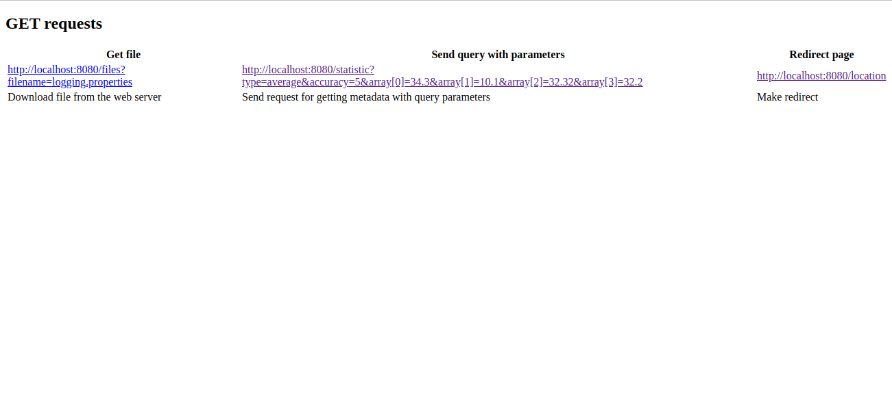

### Java HTTP Server 

Simple HTTP server based on java.net Sockets

Self-described simple multithreaded http server.

Supports GET method, Exceptional handling.

Can be enhanced to support POST, PUT, DELETE, etc. 

_For this see DispatcherWebController.java_

 
